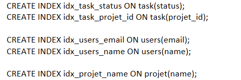

## Optimisation Base de données JPA

### Pour commencer
1) Cloner le projet
2) Run la commande à la racine du projet
```
docker-compose up -d
```
3) Lancer un build
4) Se rendre sur le lien suivant du swagger : http://localhost:8082/swagger-ui/index.html


### L'objectif de cette exercice 

Développer une application Java utilisant Spring Boot, Spring Data JPA, Spring Web, MapStruct et Lombok pour créer des endpoints CRUD. L'application doit illustrer les différentes relations JPA : @OneToMany , @ManyToMany et @OneToOne , en exposant au moins trois endpoints. La base de données utilisée sera PostgreSQL.
Les DTO (Data Transfer Objects) seront utilisés pour transférer les données entre les couches de l'application, évitant ainsi d'exposer directement les entités JPA.

### Contexte 
Vous êtes chargé de créer une application de gestion pour un système de gestion de projets.
L'application doit gérer les entités suivantes : User, Projet et Task.

## Première partie de l'exercice
### Mise en place 

- Ce projet contient des endpoints CRUD complets en utilisant Spring Boot.
- Utilisation des DTO pour séparer les couches de l'application et éviter d'exposer directement les entités JPA.
- Utilisation de  MapStruct pour le mapping entre les entités et les DTO.
- Utilisation de Lombok pour simplifier le code.

## Deuxième partie de l'exercice
### Consignes 

- Mettre en place P6SPY (afin de voir les requêtes SQL)
- Index (à vous de juger si vous en avez besoin où non)
- Query N + 1
- Pagination
- Mettre en place une vue matérialisée qui va permettre de compter le nombre de tâche qu'il y a par projet

### Index et vue matérialisée

1) Liste des index que j'ai ajouté : 



2) Mise en place de la vue matérialisée


